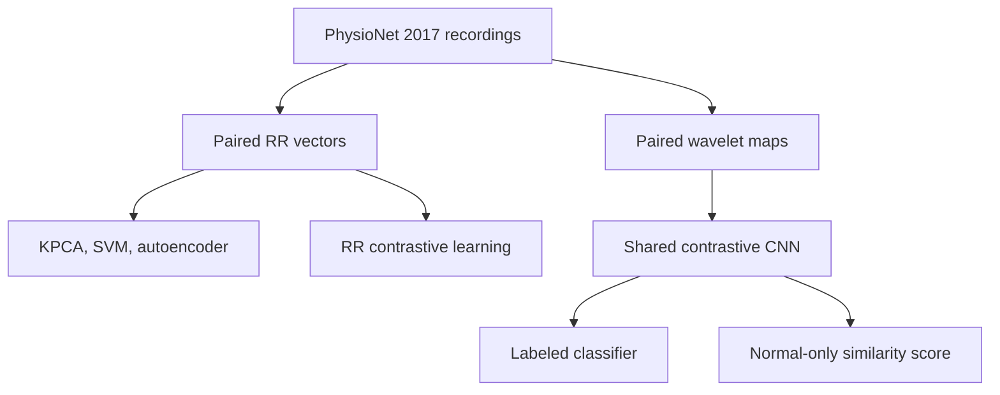

# ECG Representation Learning for Atrial Fibrillation

A bachelor-thesis project comparing RR-interval baselines with contrastive representations of paired ECG windows. The main task is binary classification of normal rhythm and atrial fibrillation (AFib) using the PhysioNet/CinC 2017 dataset.

The implementation provides shared preprocessing, reusable models, configuration-driven experiments, recording-level data splits, and a consistent evaluation pipeline. Notebooks explain and inspect the experiments; model and training code lives in the Python package.

## Research overview



Two views from one recording form a positive contrastive pair. The encoder uses a symmetric NT-Xent objective; a separate supervised classifier can learn from the embeddings. A normal-only experiment uses paired-embedding dissimilarity as its AFib-oriented score. The 50- and 100-frequency variants share the same CNN implementation.

The dataset has other rhythm and noisy-record classes, but these experiments use the normal/AFib subset. Exploratory MIMIC-IV and Icentia11k work is documented separately in the [dataset-selection notebook](notebooks/00_dataset_exploration.ipynb).

## Prepare one cohort and one split

Obtain the [PhysioNet/CinC 2017 training data](https://physionet.org/content/challenge-2017/1.0.0/) separately. Place the flat `REFERENCE.csv` and its named `.mat` files in `data/raw/training2017/`.

```bash
ecg-afib prepare --input data/raw/training2017 --output data/processed/rr15 --representation rr --rr-length 15
ecg-afib split --dataset data/processed/rr15 --output data/splits.json
ecg-afib prepare --input data/raw/training2017 --output data/processed/rr20 --representation rr --rr-length 20 --cohort data/processed/rr15
ecg-afib prepare --input data/raw/training2017 --output data/processed/wavelet50 --representation wavelet --frequencies 50 --cohort data/processed/rr15
ecg-afib prepare --input data/raw/training2017 --output data/processed/wavelet100 --representation wavelet --frequencies 100 --cohort data/processed/rr15
```

The default protocol uses the first two adjacent 15-second windows from recordings with at least 30 seconds of data, at 300 Hz. RR peak detection must succeed in each window. `--cohort` ensures later representations retain exactly the first preparation's recording IDs and labels. The split is stratified 60%/20%/20% at recording level. Every derived view stays with its recording, including during classifier training.

The original whole-record RR chunking remains available through `--rr-mode chunks`; treat that as a separate preprocessing protocol. It is not the default matched-window comparison. Details and exclusions are recorded in each feature manifest.

## Run experiments

```bash
ecg-afib run --config configs/rr_kernel_pca.toml
ecg-afib run --config configs/rr_autoencoder.toml
ecg-afib run --config configs/rr_contrastive.toml
ecg-afib run --config configs/wavelet_contrastive_50.toml
ecg-afib run --config configs/wavelet_contrastive_100.toml
ecg-afib run --config configs/wavelet_normal_only.toml
```

| Preset | Training/model | Record score |
| --- | --- | --- |
| `rr_kernel_pca.toml` | Normal-only RBF Kernel PCA | Mean reconstruction distance |
| `rr_one_class_svm.toml` | Normal-only one-class SVM | Mean negative decision function |
| `rr_kpca_classifier.toml` | Normal-only KPCA, then supervised head on training embeddings | Mean classifier probability |
| `rr_autoencoder.toml` | MLP reconstruction; both classes by default | Mean reconstruction MSE |
| `rr_contrastive.toml` | RR MLP with NT-Xent, then supervised head | Mean classifier probability |
| `wavelet_contrastive_50.toml` | 50-frequency CWT CNN with NT-Xent, then supervised head | Mean classifier probability |
| `wavelet_contrastive_100.toml` | Same pipeline with 100 frequency rows | Mean classifier probability |
| `wavelet_normal_only.toml` | Normal-only wavelet encoder | Mean paired `1 - cosine_similarity` |

All scores increase toward AFib. Thresholds maximize validation record-level balanced accuracy; specificity resolves ties. Test scores are computed afterward using that fixed threshold. The classifier learns only from training records, replacing the old split of already-flattened validation windows.

Each completed run writes configuration, environment versions, split membership, data provenance, model artifacts, predictions, and metrics under `runs/<experiment>/`. Existing nonempty run directories are never silently overwritten; use `--output runs/new_name` for a new run. `--device cuda` overrides a preset's CPU setting.

```bash
ecg-afib compare runs/rr_kernel_pca runs/wavelet_contrastive_50
jupyter lab
```

Comparison rejects mismatched cohorts or splits. Raw recordings, feature caches, model weights, and local runs are excluded from Git.


